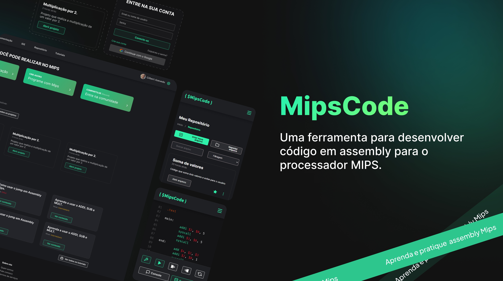

   

# Descrição do projeto

O MipsCode se encaixa na área de educação, oferecendo uma IDE amigável e intuitiva para estudantes que desejam aprender e praticar a linguagem assembly MIPS. Além disso, o MipsCode atende às necessidades de professores que desejam ensinar programação de baixo nível, fornecendo uma ferramenta poderosa e completa que facilita o aprendizado e o ensino. Com o MipsCode, os estudantes podem desenvolver habilidades importantes para trabalhar em áreas como a indústria de tecnologia e sistemas embarcados, onde a linguagem assembly é amplamente utilizada. A plataforma também atende aos entusiastas de programação de baixo nível, que desejam se aprofundar no funcionamento interno dos computadores e sistemas. O MipsCode é a ferramenta perfeita para aqueles que buscam uma experiência de aprendizado completa e eficaz em assembly MIPS.

# Equipe de desenvolvimento

### Desenvolvedores

<table>
<tr>
    <td align="center"><a href="https://github.com/dani7fl7">
        
         
        <a href="https://github.com/dani7fl7"><b>Daniela Lima</b></a>
    </td> 
    <td align="center"><a href="https://github.com/HeloiseMacena">
        
         
        <a href="https://github.com/HeloiseMacena"><b>Heloise Macena</b></a>
    </td>    
    <td align="center"><a href="https://github.com/HilquiasAbias">
        
         
        <a href="https://github.com/HilquiasAbias"><b>Hilquias Abias</b></a>
    </td>
    <td align="center"><a href="https://github.com/IcaroJustino">
        
         
        <a href="https://github.com/IcaroJustino"><b>Icaro Miranda</b></a>
    </td>
    <td align="center"><a href="https://github.com/PessoaRafael">
        
         
        <a href="https://github.com/PessoaRafael"><b>Rafael Pessoa</b></a>
    </td>
</tr>
</table>

### Orientador

<table>

<tr>
    <td align="center"><a href="https://github.com/gasilvabr">
        
         
        <a href="https://github.com/gasilvabr"><b>George Azevedo</b></a>
    </td>
</table>

# Tecnologias Utilizadas

Node, ReactJS, TypeScript, Material Design, NestJS e JavaScript

# Documentação

[Link para os documentos do projeto](doc/documentacao.md)

