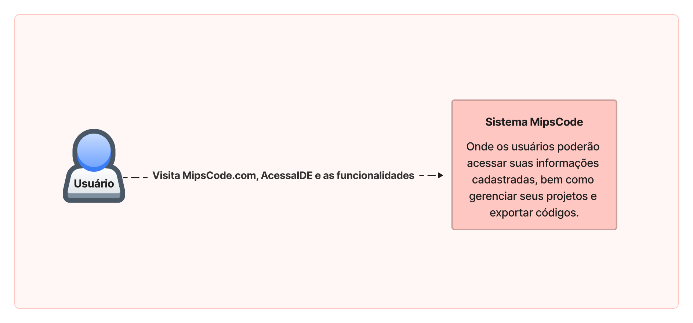
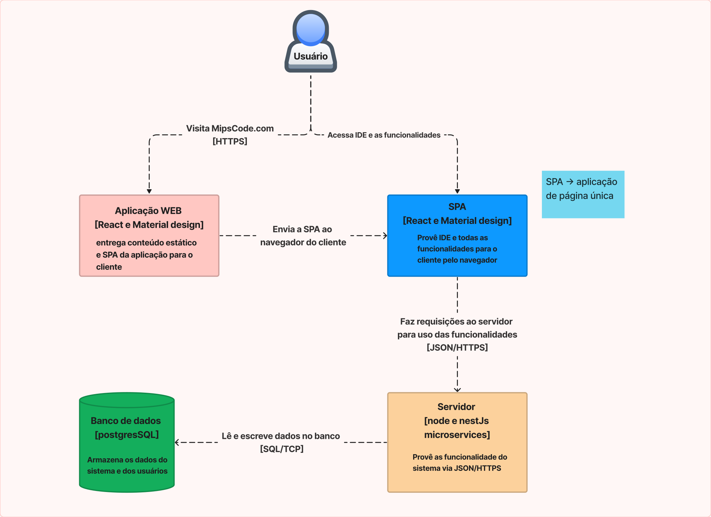
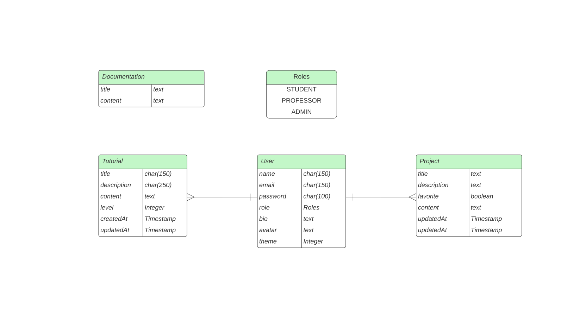

# MipsCode

### **Documento de Arquitetura do Sistema**

**Histórico da Revisão**

| Data | Versão | Descrição | Autor |
| --- | --- | --- | --- |
| 25/07/2023 | 1.0 | Versão inicial | Heloise e Ícaro |
| 25/07/2023 | 1.1 | Versão atualizada | Rafael Pessoa e  Hilquias |

# 1. Introdução
O MipsCode é uma IDE amigável para estudantes aprenderem e praticarem a linguagem assembly MIPS. Também é útil para professores ensinarem programação de baixo nível. Atende a áreas como tecnologia e sistemas embarcados, sendo ideal para entusiastas de programação de baixo nível. É uma ferramenta completa e eficaz para aprender assembly MIPS.

# 2. Termos e Abreviações
- **IDE:** Ambiente de desenvolvimento integrado que oferece uma interface gráfica para desenvolver, testar e depurar software.
- **MIPS Assembly:** Linguagem de programação de baixo nível usada em arquiteturas baseadas em MIPS. 
- **Simulador:** Um software que permite a execução de um programa em um ambiente controlado que imita o comportamento de um dispositivo real.
- **Sistema de arquivos:** Componente do sistema operacional que gerencia o armazenamento e a recuperação de dados em dispositivos de armazenamento.
- **Tutorial:** Conteúdo instrucional apresentado em um formato passo a passo, destinado a ensinar um conceito ou habilidade específica.
- **Console:** Uma área na interface do usuário que exibe informações de status ou saída do programa.
- **Registradores:** Dispositivos de hardware usados para armazenar e manipular informações digitais.
- **Dashboard:** Um painel visual que apresenta informações resumidas e importantes de um sistema ou conjunto de dados.
- **Fórum:** Plataforma online de discussão em grupo para compartilhar informações, opiniões e ideias.

**Tipos de usuário:**

- **Usuário:** Qualquer pessoa que utiliza o website.
- **Visitante:** Um usuário que acessa o site sem se registrar ou fazer login.
- **Professor:** Um usuário que ensina ou orienta outros usuários no aprendizado da linguagem de programação MIPS Assembly.
- **Estudante:** Um usuário que está aprendendo a linguagem de programação MIPS Assembly.
- **Administrador:** Um usuário que gerencia o website e os usuários cadastrados.

# 3. Requisitos Significantes
| Código | Nome | Descrição |
| --- | --- | --- |
| RNF001 | Tempo de resposta | O sistema deve ser capaz de garantir a  comunicação entre o servidor e o cliente, não podendo ultrapassar o tempo de 5 segundos de resposta na exportação. |
| RNF007 | Exportação de Arquivo | O sistema deve ser capaz de disponibilizar o arquivo exportado pelo usuário em extensão ASM e XML. |
| RNF002 | Facilidade de Uso | O sistema deve fornecer uma interface amigável e intuitiva que permita aos usuários interagir facilmente com ele, visando melhorar a experiência do usuário e aumentar a produtividade. |
| RNF004 | Monitorar os tutoriais | O administrador deverá manter a qualidade dos tutoriais, assegurando que eles sejam atualizados, precisos, e acessíveis aos usuários, por meio de um processo contínuo de revisão, atualização e depuração do código. |
| RNF006 | Disponibilidade de armazenamento de arquivos | O sistema deverá realizar o gerenciamento de cache para armazenamento de arquivos locais.|
| RNF005 | Requisitos Legais | O administrador deverá adequar a plataforma de acordo com as normas legais(LGPD), garantindo a integridade de dados sensíveis armazenando-os no banco de dados com token de segurança. |
| RNF003 | Manutenção e suporte da IDE | O administrador irá garantir o funcionamento correto da IDE, assegurando um alto grau de impacto. |

# 4. Restrições Arquiteturais
### 4.1.Restrições técnicas
|  | Restrição | Contexto e/ou Motivação |
| :--- | :--- | :--- |
| Restrição de software e programação |
| RT1 | Acessibilidade | A interface atual não conta com nenhum conjunto de ferramentas que possa auxiliar pessoas com deficiência. |
| Restrição de sistema operacional |
| RT2 | Segurança | A ausência de suporte a determinadas medidas de segurança, como criptografia ou autenticação, por parte do sistema operacional pode expor o aplicativo a vulnerabilidades e possíveis ataques. |
| Restrições de Hardware |
| RT3 | Conectividade de rede | Quando a conectividade de rede é limitada, a velocidade e a disponibilidade do aplicativo podem ser afetadas.. |


# 5. Escopo do Sistema e Contexto

## 5.1 Diagrama de Contexto


A figura acima contempla o diagrama de contexto do sistema MipsCode utilizado no projeto de sistemas distribuídos (PDS). Nele são evidenciados os blocos que trazem o nome do sistema e o que interage com ele, além do usuário que realiza uma ação.

## 5.2 Diagrama de Containers

Quanto às interações, os containers interagem entre si por meio de interfaces bem definidas e troca de mensagens. O container de Interface do Usuário pode enviar comandos e dados para o container de Lógica de Negócios, que, por sua vez, pode acessar ou atualizar informações no container de Armazenamento de Dados. O container de Assembler recebe informações do container de Lógica de Negócios e gera o código de máquina a ser executado pelo container de Simulador de Hardware.

Com relação aos atores externos, estes podem interagir principalmente com o container de Interface do Usuário, enviando comandos e recebendo respostas ou informações relevantes por meio da interface disponibilizada pelo sistema. Os atores externos podem ser usuários humanos, outros sistemas, ou mesmo dispositivos periféricos que se comuniquem com o sistema MipsCode.

# 6. Diagramas Conceituais

## 6.1 Visão Lógica

### 6.2 Modelos de domínio


| Conceito | Descrição |
| --- | --- |
| User | Tabela que mantém os dados dos professores e pacientes na plataforma | 
| Tutorial | Mantém os tutoriais criados pelos professores | 
| Project | Mantém os projetos criados pelos usuários  | 
| Documentation | Mantém os arquivos da documentação do Assembly MIPS | 
| Roles | Enum que classifica os tipos de usuários da plataforma  | 


# 7. Detalhamento da Implementação e Ambiente Físico

## 7. Detalhamento da Implementação e Ambiente Físico

### 7.1.	Visão de Distribuição
| Nó | Descrição |
| :--- | :--- |
| SGBD - PostgreSQL | Sistema de banco de dados da aplicação |
| Servidor da aplicação - Frontend | Conjunto de interfaces e páginas da aplicação |
| Servidor da aplicação - Backend | Conjunto de classes, regras de negocio e endpoints |
| Computador do usuario | Maquina que o usuario utilizará para fazer acesso a aplicação |

### 7.2. Persistência
| Classe | Tabela | Significado |
| :--- | :--- | :--- |
IDE|ide|Realiza a montagem do código
Tutorial|tutoriais|Campo onde um usuário pode verificar os tutoriais do MIPS32
Documentação|documentações|Documentação da página que o usuário pode acessar
Estudante|estudantes|Usuario que pode realizar login no sistema e acessar sua turma/atividade
Usuario|usuarios|Usuario base do sistema
Professor|professores|Usuario que pode realizar login no sistema e cadastrar turma/tarefa
Visitante|visitantes|Usuario que acessa a página e utiliza suas funcionalidades não estando logado

### 7.3. Interface de Usuário

O design da interface foi esboçado usando a plataforma Figma. Também foi utilizado O React-JS junto do MaterialUI na estilização dos componentes para o frontend.

# 8. Anexos

## 8.1 API do Projeto
**Criação de um projeto**

Uma requisição POST que listará todos os agendamentos.

**Parâmetros da requisição**

| Parâmetros | Descrição            |
|------------|----------------------|
| title      | título do projeto    |
| description| descrição do projeto |
| content    | arquivo mips mars    |
| userId     | ID do autor do projeto |

**Estrutura da resposta**

| Path          | Tipo    | Descrição                   |
|---------------|---------|-----------------------------|
| [ ]           | Object  | toda a descrição do projeto |
| [ ].id        | String  | id do Projeto               |
| [ ].title     | String  | Título do projeto           |
| [ ].description | String| descrição do projeto        |
| [ ].favorite  | Boolean | status se o projeto foi favoritado pelo autor |
| [ ].userId    | String  | id do Autor do projeto      |

**Exemplo de requisição**
POST 'http://localhost:3000/projects'

**Exemplo de resposta**

```json
{
  "id": "9623eb26-d21f-44e0-9c67-17300d2807c9",
  "title": "projeto teste 23 3 4 512",
  "description": "",
  "favorite": false,
  "content": "",
  "userId": "95cfb5d3-106a-46bc-87ea-13083d67a175",
  "createdAt": "2023-05-30T21:48:02.774Z",
  "updatedAt": "2023-05-30T21:48:02.774Z"
}

