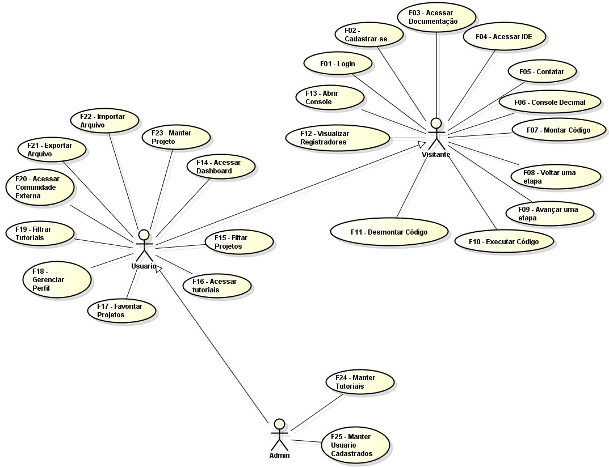

# Modelo de Casos de Uso

## 1. Diagrama de Casos de Uso

## 2. Listagem dos detalhamentos dos casos de uso

1. [CDU-001 - Login](cdu-001/detalhamento-001.md)
2. [CDU-002 - Cadastrar-se](cdu-002/detalhamento-002.md)
3. [CDU-003 - Acessar Documentação](cdu-003/detalhamento-003.md)
4. [CDU-004 - Acessar IDE](cdu-004/detalhamento-004.md)
5. [CDU-005 - Contatar](cdu-005/detalhamento-005.md)
6. [CDU-006 - Console decimal](cdu-006/detalhamento-006.md)
7. [CDU-007 - Montar Código](cdu-007/detalhamento-007.md)
8. [CDU-008 - Voltar uma etapa](cdu-008/detalhamento008.md)
9. [CDU-009 - Avançar uma etapa](cdu-009/detalhamento009.md)
10. [CDU-010 - Executar Código](cdu-010/detalhamento010.md)
11. [CDU-011 - Desmontar Código](cdu-011/detalhamento011.md)
12. [CDU-012 - Visualizar Registradores](cdu-012/detalhamento012.md)
13. [CDU-013 - Abrir Console](cdu-013/detalhamento013.md)
14. [CDU-014 - Acessar Dashboard](cdu-014/detalhamento014.md)
15. [CDU-015 - Filtrar Projetos](cdu-015/detalhamento015.md)
16. [CDU-016 - Acessar Tutoriais](cdu-016/detalhamento016.md)
17. [CDU-017 - Favoritar Projetos](cdu-017/detalhamento017.md)
18. [CDU-018 - Gerenciar Perfil](cdu-018/detalhamento018.md)
19. [CDU-019 - Filtrar Tutoriais](cdu-019/detalhamento019.md)
20. [CDU-020 - Acessar Comunidade Externa](cdu-020/detalhamento020.md)
21. [CDU-021 - Exportar arquivo](cdu-021/detalhamento021.md)
22. [CDU-022 - Importar Arquivo](cdu-022/detalhamento022.md)
23. [CDU-023 - Manter Projeto](cdu-023/detalhamento023.md)
24. [CDU-024 - Manter Tutoriais](cdu-024/detalhamento024.md)
25. [CDU-024 - Manter Usuarios Cadastrados](cdu-025/detalhamento025.md)
