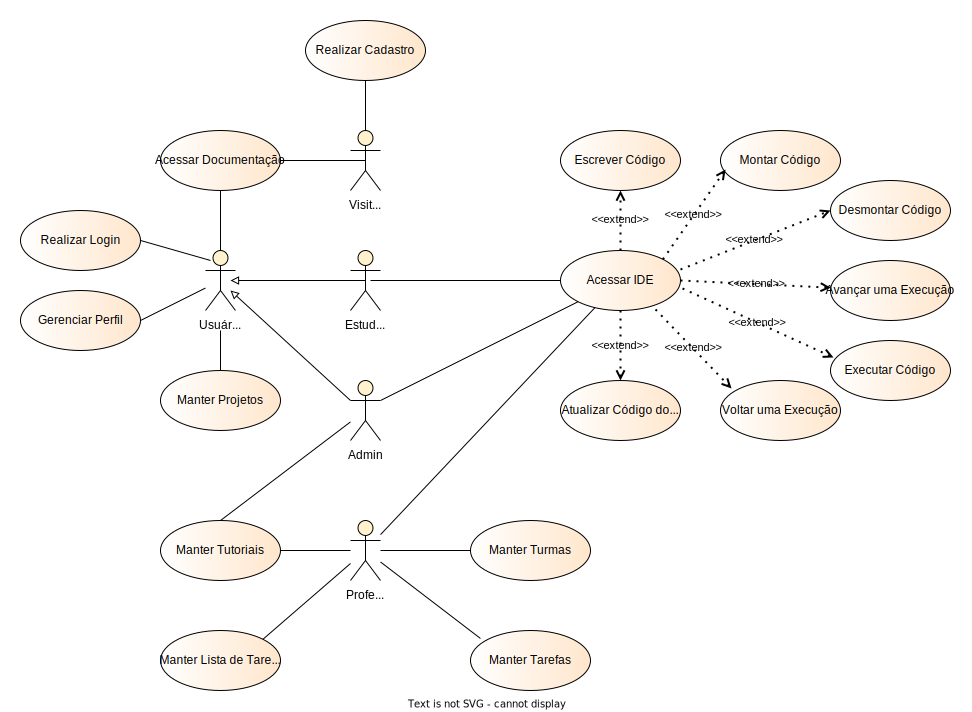

# Modelo de Casos de Uso

## 1. Diagrama de Casos de Uso

## 2. Listagem dos detalhamentos dos casos de uso

1. [CDU-001 - Realizar Cadastro](CDU001_Realizar_Cadastro.md)
2. [CDU-002 - Realizar Login](CDU002_Realizar_Login.md)
3. [CDU-003 - Acessar Documentação](CDU003_Acessar_Documentação.md)
4. [CDU-004 - Acessar IDE](CDU004_Acessar_IDE.md)
5. [CDU-005 - Escrever Código](CDU005_Escrever_Código.md)
6. [CDU-006 - Montar Código](CDU006_Montar_Código.md)
7. [CDU-007 - Voltar uma Execução](CDU007_Voltar_uma_Execução.md)
8. [CDU-008 - Avançar uma Execução](CDU008_Avançar_uma_Execução.md)
9. [CDU-009 - Desmontar Código](CDU009_Desmontar_Código.md)
10. [CDU-010 - Executar Código](CDU010_Executar_Código.md)
11. [CDU-011 - Atualizar Código do Projeto](CDU011_Atualizar_Código_do_Projeto.md)
12. [CDU-012 - Gerenciar Perfil](CDU012_Gerenciar_Perfil.md)
13. [CDU-013 - Manter Projetos](CDU013_Manter_Projetos.md)
14. [CDU-014 - Manter Tutoriais](CDU014_Manter_Tutoriais.md)
15. [CDU-015 - Manter Turmas](CDU015_Manter_Turmas.md)
16. [CDU-016 - Manter Lista de Tarefas](CDU016_Manter_Lista_de_Tarefas.md)
17. [CDU-017 - Manter Tarefas](CDU017_Manter_Tarefas.md)
