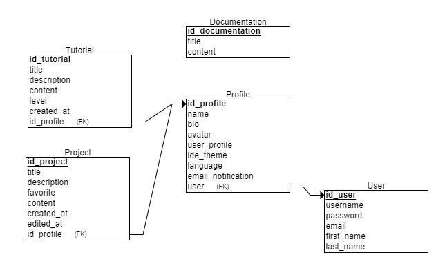

# Documento ORM (Mapeamento Objeto-Relacional)
Projeto MIPSCODE - Documento do Mapeamento entre os Objetos (Classes do Domínio) e os elementos do Modelo Relacional.

## Diagrama de Classes de Domínio

## Modelo Relacional

## Classes versus Tabelas
| Classe              |  Tabela             |   Significado       |
| :-----------------: | :-----------------: | :-----------------: |
| User                | User                |  Modelo de login padrão do django. | 
| Profile             | Profile             | Classe que representa o perfil do usuário que armazena project e tutorials. |
| Documentation       | Documentation       | Classe que armazena a aba de “documentação” do site. |
| Project             | Project             | Classe que representa os projetos do usuário. |
| Tutorial            | Tutorial            | Classe que representa a aba de tutoriais do site. |

## Relacionamentos
| Tabela Origem       |  Through            |   Tabela Destino    | Significado         |
| :-----------------: | :-----------------: | :-----------------: | :-----------------: |
| Profile             |  -                  |  User               | Indica o login que criou o perfil. |
| Tutorial            |  -                  |  Profile            | Indica o Perfil que criou o tutorial. |
| Project             |  -                  |  Profile            | Indica o Perfil que criou o projeto. |
